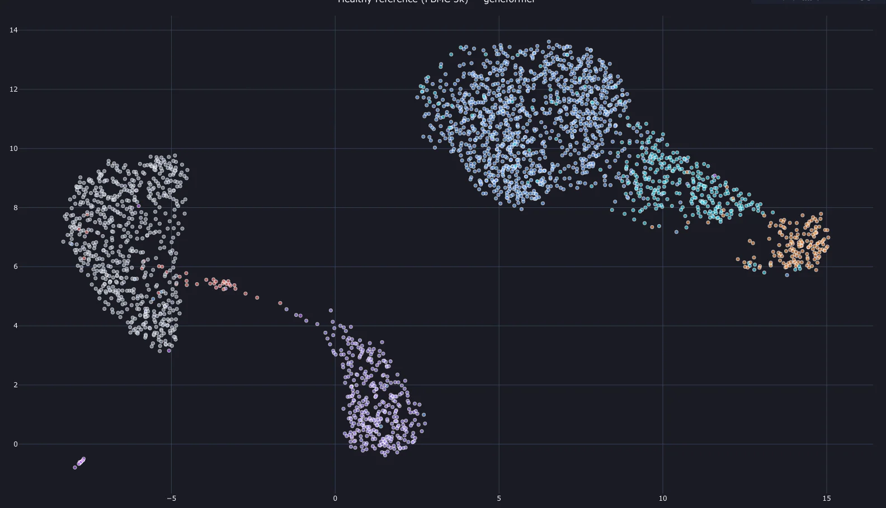
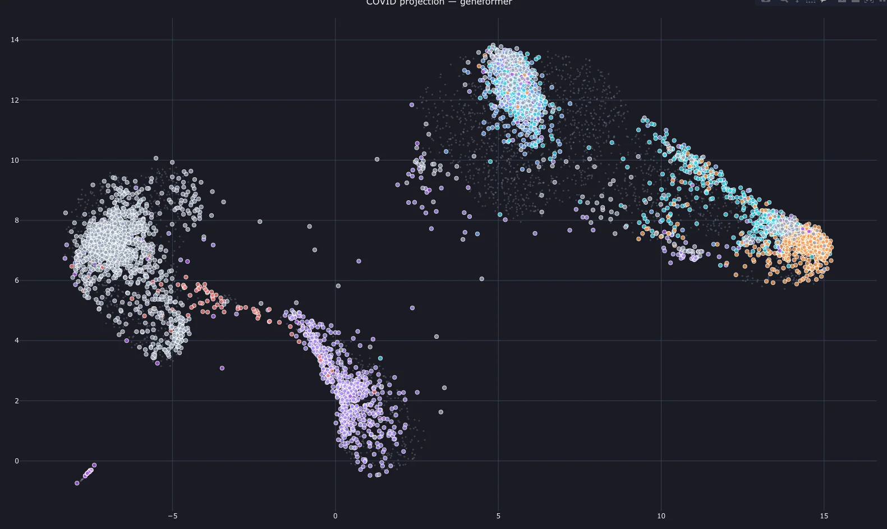
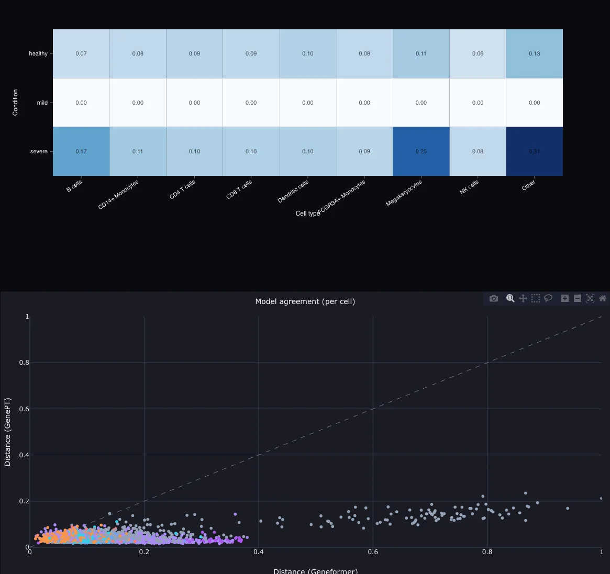
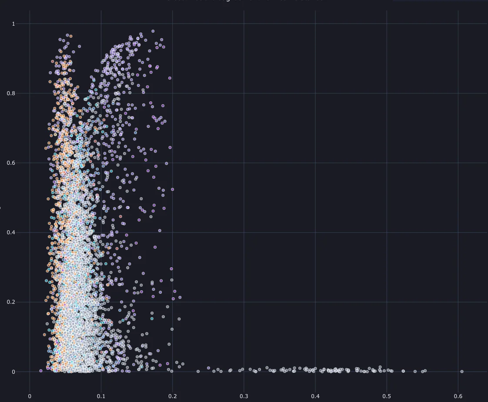

# Helical Bio Explorer

> When cells go wrong, how do we see it faster?

Embed patient cells with foundation models, map them against a healthy reference, and surface the differences that matter — at single-cell resolution.

<p align="center">
  <a href="https://helical.manumustudio.com"><strong>Live Demo</strong></a> · <a href="https://api.helical.manumustudio.com/docs"><strong>API Docs</strong></a> · <a href="https://github.com/manumu-studio/helical-bio-explorer"><strong>Source Code</strong></a>
</p>

---

<p align="center">
  
</p>

---

## What it does

A data processing pipeline ingests public single-cell RNA-seq data, runs it through two bio foundation models (**Geneformer** and **GenePT** via the [Helical SDK](https://github.com/helicalAI/helical)), and writes precomputed embeddings to Parquet. The embedding pipeline takes **healthy PBMC cells** as a reference baseline, then projects **COVID patient cells** ([Wilk et al.](https://www.nature.com/articles/s41591-020-0944-y) dataset from CELLxGENE Census) into that same latent space using UMAP dimensionality reduction.

The dashboard compares model outputs, quantifies per-cell divergence from healthy baseline, and surfaces where the two models agree or disagree — turning raw embeddings into interpretable biology.

## Dashboard

Four interactive views, each revealing a different dimension of how disease reshapes cell identity:

### Reference Atlas
Healthy PBMC baseline embedded with Geneformer — UMAP (Uniform Manifold Approximation and Projection) visualization of ~3,000 cells, colored by cell type.

<p align="center">
  
</p>

### Projection
COVID patient cells projected into the healthy reference space. Colored dots = disease cells overlaid on the gray healthy baseline. Shows where patient cells cluster near or far from their healthy counterparts.

<p align="center">
  
</p>

### Distance
Divergence heatmap (condition × cell type) and per-cell model agreement scatter. Quantifies how far each cell type has shifted from baseline across disease severity levels.

<p align="center">
  
</p>

### Disagreement
Where Geneformer and GenePT disagree on how much a cell has changed. Points far from the diagonal indicate cell populations where model architecture matters most.

<p align="center">
  
</p>

## Architecture

```
┌─────────────────────────────────┐
│         Next.js 15 + TS         │  Vercel
│   Plotly · Tailwind v4 · Zod   │
└──────────────┬──────────────────┘
               │ REST
┌──────────────▼──────────────────┐
│        FastAPI (Python)         │  AWS EC2
│   Pydantic · Parquet · S3      │
└──────────────┬──────────────────┘
               │
┌──────────────▼──────────────────┐
│   Embedding & Reduction Pipeline│  S3 (Parquet)
│   Geneformer · GenePT · UMAP   │
│   Model comparison · Distances  │
└─────────────────────────────────┘
```

## API

| Endpoint | Description |
|---|---|
| `GET /api/v1/embeddings/{dataset}/{model}` | Raw model embeddings |
| `GET /api/v1/projections/{dataset}/{model}` | UMAP-projected coordinates |
| `GET /api/v1/distances/{dataset}/{model}` | Per-cell distances from reference |
| `GET /api/v1/disagreement/{dataset}` | Cross-model disagreement scores |
| `GET /api/v1/summary/{dataset}` | Aggregated stats by cell type and condition |
| `GET /health` | Service health check |

Full OpenAPI spec: [api.helical.manumustudio.com/docs](https://api.helical.manumustudio.com/docs)

## Stack

| Layer | Technology |
|---|---|
| **Frontend** | Next.js 15, React, TypeScript (strict), Tailwind CSS v4, Plotly.js, Zod |
| **Backend** | Python 3.11, FastAPI, Pydantic, Pandas, PyArrow |
| **Models** | [Helical SDK](https://github.com/helicalAI/helical) (Geneformer, GenePT) |
| **Data** | Parquet on S3, PBMC 3k + Wilk et al. COVID dataset (CELLxGENE Census) |
| **Infra** | Vercel (frontend), AWS EC2 (backend), GitHub Actions (CI/CD) |
| **Quality** | pytest, Husky pre-commit hooks, GitHub Actions CI, ruff + mypy (backend), ESLint + tsc (frontend) |

## Quick start

```bash
# Backend
cd backend
uv venv --python 3.11 .venv && source .venv/bin/activate
uv pip install -e ".[dev]"
uvicorn app.main:app --reload --port 8000

# Frontend (separate terminal)
cd frontend
corepack enable && pnpm install
echo "NEXT_PUBLIC_BACKEND_URL=http://localhost:8000" > .env.local
pnpm dev
```

## License

MIT
