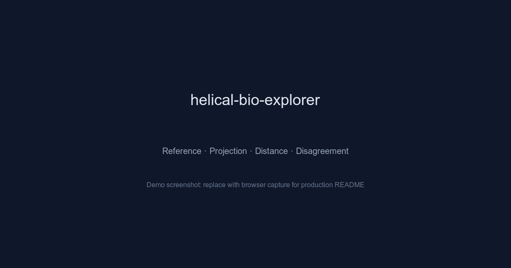

# Helical Bio Explorer

> When cells go wrong, how do we see it faster?

Embed patient cells with foundation models, map them against a healthy reference, and surface the differences that matter — at single-cell resolution.



## Live

| | URL |
|---|---|
| **Dashboard** | [helical-bio-explorer.vercel.app](https://helical-bio-explorer.vercel.app) |
| **API docs** | [api.helical.manumustudio.com/docs](https://api.helical.manumustudio.com/docs) |
| **Source** | [github.com/manumu-studio/helical-bio-explorer](https://github.com/manumu-studio/helical-bio-explorer) |

## What it does

1. **Reference atlas** — 2,638 healthy PBMC cells embedded by Geneformer via the [Helical SDK](https://helical.bio), UMAP-projected and color-coded by 8 immune cell types.
2. **Disease projection** — 5,000 COVID-19 immune cells (Wilk et al. 2020) projected into the healthy manifold. Distance-to-reference quantifies per-cell abnormality.
3. **Distance analysis** — Heatmap of mean distance-to-healthy by cell type and disease severity, surfacing which immune populations diverge most.
4. **Model disagreement** — Geneformer and GenePT, trained on different objectives, compared cell-by-cell. Percentile-rank disagreement maps where they see different things.

## Stack

| Layer | Technology |
|---|---|
| **Backend** | Python 3.11, FastAPI, SQLModel, Alembic, pytest |
| **Frontend** | Next.js 15, React 19, TypeScript (strict), Tailwind CSS v4, Plotly, Zustand |
| **Models** | Geneformer + GenePT via [Helical SDK](https://github.com/helicalAI/helical) |
| **Data** | Precomputed embeddings in Parquet (S3 + local fallback) |
| **Database** | Neon Postgres (dataset registry, precompute provenance) |
| **Infra** | Vercel (frontend), EC2 + Nginx + Let's Encrypt (API), GitHub Actions CI |

## API

All endpoints are read-only `GET` requests with optional `cell_type` and `disease_activity` filters.

| Endpoint | Description |
|---|---|
| `GET /health` | Health check |
| `GET /api/datasets` | List all datasets |
| `GET /api/v1/embeddings/{dataset}/{model}` | UMAP embedding coordinates |
| `GET /api/v1/projections/{dataset}/{model}` | Disease cells projected into reference manifold |
| `GET /api/v1/scores/{dataset}` | Distance-to-healthy scores (both models) |
| `GET /api/v1/disagreement/{dataset}` | Cross-model disagreement per cell |
| `GET /api/v1/summary/{dataset}` | Aggregated statistics |
| `GET /api/v1/provenance/{dataset}/{model}` | Precompute run metadata |

Interactive docs at [`/docs`](https://api.helical.manumustudio.com/docs) (Swagger UI).

## Quick start

```bash
# Backend
cd backend
uv venv --python 3.11 && source .venv/bin/activate
uv sync --frozen
cp .env.example .env  # fill in Neon URLs
alembic upgrade head
python -m app.scripts.seed_datasets
uvicorn app.main:app --reload --port 8000

# Frontend (separate terminal)
cd frontend
corepack enable && pnpm install
echo 'NEXT_PUBLIC_BACKEND_URL=http://localhost:8000' > .env.local
pnpm dev
```

## Project structure

```
backend/
  app/
    api/v1/          # FastAPI route handlers
    services/        # ParquetStore, ParquetReader
    schemas/         # Pydantic request/response models
    scripts/         # Dataset seeding, precompute utilities
  tests/             # pytest suite
  data/parquet/      # Local parquet fallback

frontend/
  app/
    (public)/        # Landing page (scroll showcase)
    dashboard/       # Main dashboard with 4 analysis tabs
  components/
    AppHeader/       # Shared header (landing + dashboard)
    ReferenceView/   # Healthy PBMC atlas tab
    ProjectionView/  # COVID projection tab
    DistanceView/    # Distance heatmap + scatter tab
    DisagreementView/  # Cross-model comparison tab
    landing/         # Landing page sections
    ui/              # shadcn primitives
  lib/
    stores/          # Zustand selection store
    plotly/          # Plotly theme + hooks
    schemas/         # Zod validation schemas
```

## Architecture decisions

Key decisions are documented in [`docs/research/DECISIONS.md`](docs/research/DECISIONS.md):

- **Reference mapping over fine-tuning** — project disease into healthy space rather than retrain
- **Parquet over live inference** — precompute embeddings in Colab, serve as static artifacts
- **S3 with local fallback** — resilient reads without hard S3 dependency
- **Dual ORM** — SQLModel (backend) + Prisma (frontend) on non-overlapping tables

## Built by

[ManuMu Studio](https://manumustudio.com) — powered by [Helical AI](https://helical.bio) foundation models.

## License

MIT
